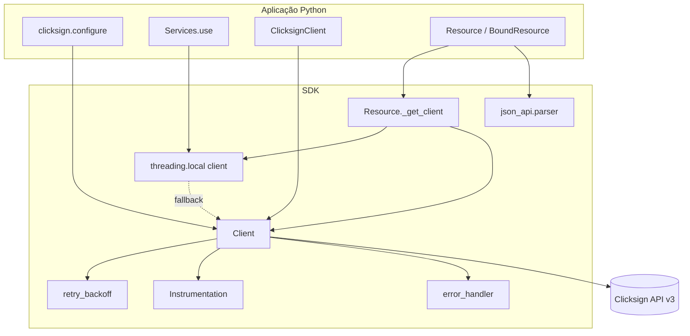
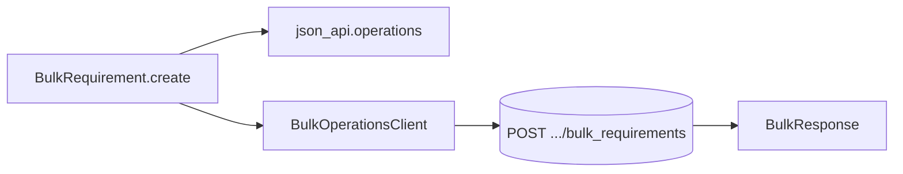
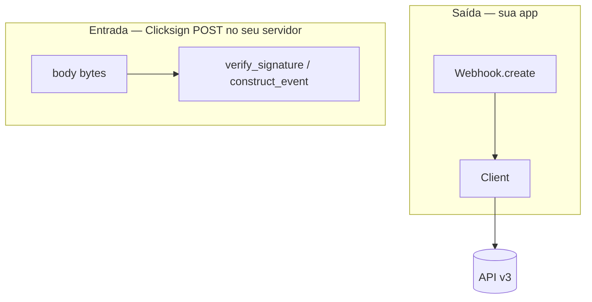
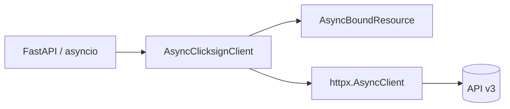

# Arquitetura — Clicksign Python SDK

Visão de alto nível de HTTP, resources e configuração. Rotas e entidades: [`SPEC.md`](SPEC.md).

---

## Diagrama — requisição típica (resources)

1. A app chama `client.envelopes.create(...)`, `Envelope.list()`, ou `Envelope.filter(...)` dentro de `Services.use()`.
2. `Resource` resolve o client: `threading.local` (dentro de `use`) ou client global de `configure()`.
3. `Client` serializa JSON:API, aplica retry com jitter / `Retry-After`, publica hooks e mapeia erros HTTP.
4. A resposta vira instâncias `Resource` com properties tipadas e `last_response`.

---

## Diagrama — bulk requirements

`BulkRequirement` usa `BulkOperationsClient` (pareado com `ClicksignClient` ou config global):

Retry no bulk: **somente timeout** (sem 429/5xx automático).

---

## Diagrama — webhook (entrada)

Cadastro na API via `client.webhooks`; validação do callback é independente:

---

## Diagrama — async

Sem `Services.use()` — client explícito por escopo.

---

## Módulos principais

| Módulo | Responsabilidade |
|--------|------------------|
| `configuration.py` | Defaults globais (`configure`) |
| `client.py` / `async_client.py` | HTTP JSON:API |
| `http_transport.py` | `UrllibHTTPClient`, `HttpxHTTPClient` |
| `http_executor.py` | Retry, instrumentation, logging |
| `resource.py` | CRUD, `QueryProxy`, paginação |
| `clicksign_client.py` | Facade + namespaces |
| `json_api/*` | Serializer, parser, bulk |
| `webhook.py` | HMAC + `construct_event` |
| `instrumentation.py` | `on_request`, `on_retry`, `on_error` |

---

## Referência

- Índice de docs: [`README.md`](README.md)
- Limitações produção: [`examples/08-production-limitations.md`](examples/08-production-limitations.md)
