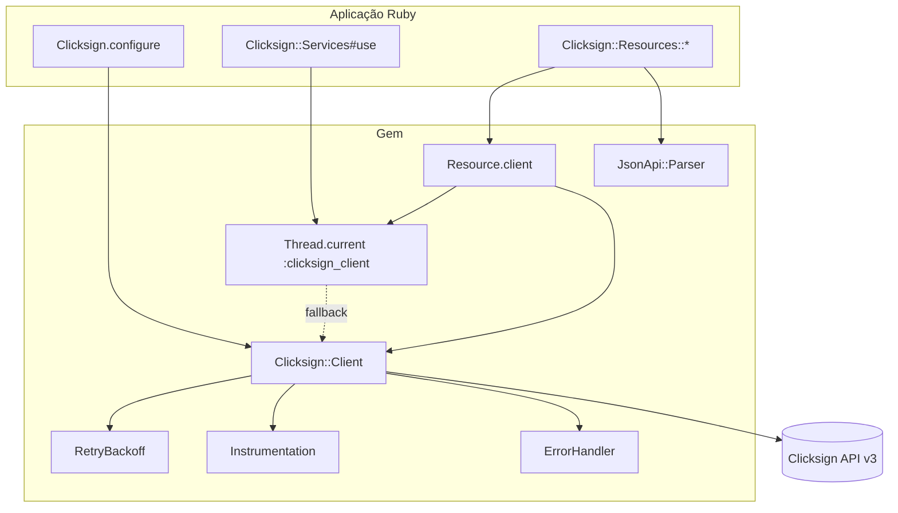
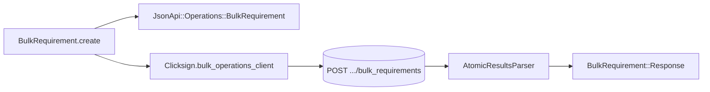
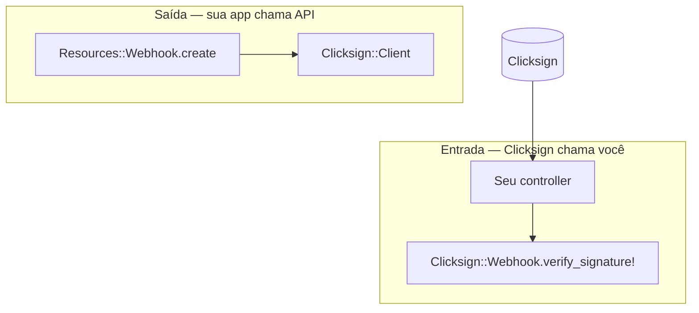
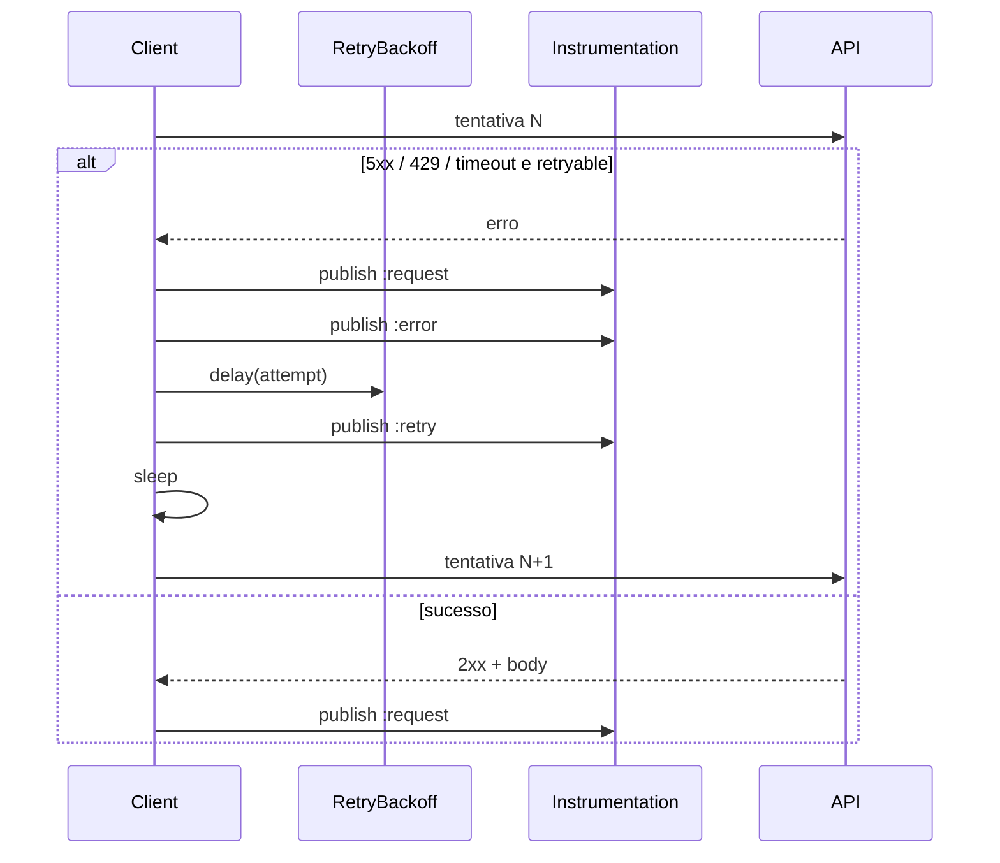

# Arquitetura — Clicksign Ruby SDK

Visão de alto nível de como a gem organiza HTTP, resources e configuração. Para rotas e entidades da API, veja [`SPEC.md`](SPEC.md).

---

## Diagrama — requisição típica (resources)

1. A aplicação chama `Envelope.create`, `Envelope.filter(...).to_a`, `Webhook.list`, etc.
2. `Resource` resolve o client: `Thread.current[:clicksign_client]` (dentro de `Services#use`) ou `Clicksign.client` (config global).
3. `Client` serializa JSON:API, aplica retry com jitter, publica eventos e mapeia erros HTTP.
4. A resposta é parseada em objetos `Resource` com atributos dinâmicos.

---

## Diagrama — bulk requirements

`BulkRequirement` **não** passa pelo thread-local do `Services`; usa o client global memoizado:

---

## Diagrama — webhook (entrada)

Cadastro na API usa `Resources::Webhook` (fluxo resources). Validação do callback é independente:

---

## Camadas e responsabilidades

| Camada | Arquivo(s) | Papel |
|--------|------------|-------|
| Entrada | `lib/clicksign.rb` | `configure`, `client`, `bulk_operations_client`, `on_*` |
| Config | `configuration.rb` | `api_key`, `environment`, timeouts, `max_retries`, `logger` |
| Multi-conta | `services.rb` | `Services#use` → thread-local client |
| HTTP | `client.rb` | GET/POST/PATCH/DELETE, retry, instrumentação |
| Bulk HTTP | `json_api/bulk_operations_client.rb` | POST atomic; retry só em timeout |
| Backoff | `retry_backoff.rb` | Exponential + full jitter |
| Resources | `resource.rb`, `resources/**` | CRUD, `QueryProxy`, paginação |
| JSON:API | `serializer.rb`, `parser.rb`, `query_builder.rb` | Payload e filtros |
| Bulk ops | `operations/bulk_requirement.rb`, `atomic_results_parser.rb` | Montagem e parse de slots |
| Erros | `errors.rb`, `error_handler.rb` | Exceções + metadados HTTP |
| Webhook HMAC | `webhook.rb` | Verificação de assinatura (entrada) |
| Observabilidade | `instrumentation.rb` | Eventos `:request`, `:retry`, `:error` |

---

## Dois caminhos de configuração HTTP

| Modo | Quem define o token | Uso |
|------|---------------------|-----|
| **Global** | `Clicksign.configure` → `Clicksign.client` | Single-tenant, scripts, console |
| **Por contexto** | `Services.new(...)` → `use { }` | Multi-tenant, Sidekiq por conta |

`Clicksign::Client.new` é o terceiro caminho: instância explícita, sem `Resources` (HTTP manual).

---

## Retry e instrumentação (só no `Client`)

`BulkOperationsClient` usa os mesmos hooks (`RequestInstrumentation`); retry automático apenas em `TimeoutError` (não em 5xx/429).

---

## Stack

| Tecnologia | Uso |
|------------|-----|
| Ruby ≥ 3.0 | Runtime |
| `net/http`, `json`, `uri` | Únicas deps de produção |
| OpenSSL (stdlib) | HMAC de webhooks |

---

## Limitações de design

| Limitação | Detalhe |
|-----------|---------|
| **Sem connection pool** | Cada HTTP = `Net::HTTP.start` novo; em Puma de alta concorrência pode doer em latência/TCP |
| **`Thread.current` em `Services#use`** | OK em Puma/Sidekiq; **não** confiável com Falcon, async-ruby ou Fibers filhos |

Mitigações e cenários: [cookbook/08-production-limitations.md](cookbook/08-production-limitations.md).

---

## Documentação relacionada

| Tópico | Link |
|--------|------|
| Fluxo notarial | [WORKFLOW.md](WORKFLOW.md) |
| Receitas | [cookbook/](cookbook/) |
| Erros comuns | [TROUBLESHOOTING.md](TROUBLESHOOTING.md) |
| Logs e métricas | [OBSERVABILITY.md](OBSERVABILITY.md) |
| Mapa de API | [SPEC.md](SPEC.md) |
